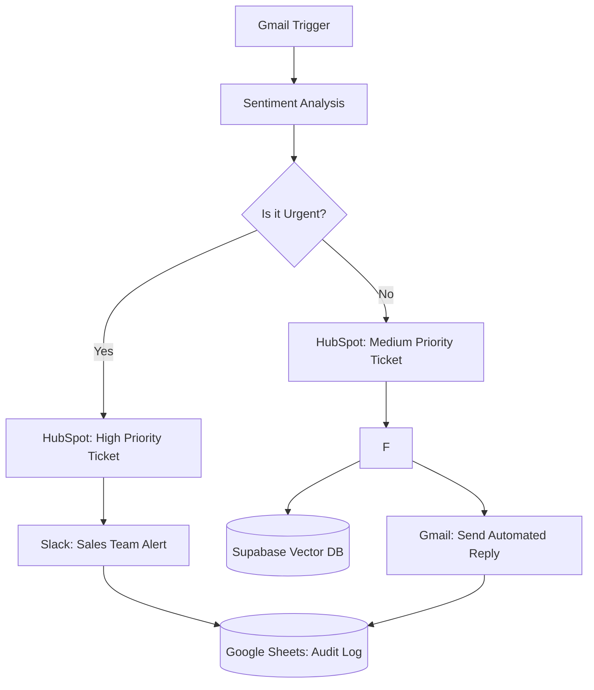

# 🤖 Customer Support AI Automation

An intelligent **n8n workflow** designed to triage, route, and resolve customer support inquiries using **GPT-5-mini** and **RAG (Retrieval-Augmented Generation)**. 

---

## ✨ Key Features

* **AI Sentiment & Intent Analysis**: Automatically classifies emails into categories like `refund`, `complaint`, or `technical_issue`.
* **Urgency-Based Routing**: Detects angry sentiment or "ASAP" language to flag tickets as **Urgent** and trigger immediate Slack alerts.
* **Knowledge-Base Integration (RAG)**: Uses a **Supabase Vector Database** to "read" the company docs and provide factual, non-hallucinated answers.
* **Automated CRM Management**: 
    * Searches for existing contacts in **HubSpot**.
    * Creates and assigns support tickets with appropriate priority levels.
    * Logs all interactions in a master **Google Sheets** audit trail.
* **Human-like Responses**: Drafts and sends professional, structured email replies via **Gmail**.

---

## 🏗️ System Architecture

## 🛠️ Tech Stack

* **Automation**: [n8n.io](https://n8n.io/)
* **AI Engine**: OpenAI (GPT-5-mini)
* **Memory/Knowledge**: Supabase (Vector Store) 
* **CRM**: HubSpot
* **Communication**: Gmail & Slack
* **Logging**: Google Sheets

---

## 📋 Workflow Breakdown

### 1. Ingestion & Analysis
The workflow monitors Gmail every minute. Once an email arrives, it is cleaned and sent to the **Sentiment Analysis** node. The AI classifies the intent (Refund, Technical, etc.) and checks for "Urgent" keywords or angry sentiment.

### 2. Intelligent Routing
* **Urgent Path**: Creates a "High Priority" ticket in HubSpot, alerts the team on Slack, and creates a log entry.
* **Standard Path**: Creates a "Medium Priority" ticket and moves directly to the AI Agent for resolution.

### 3. Retrieval-Augmented Generation (RAG)
The AI Agent is equipped with a **Vector Database** tool. For product questions or refund instructions, the agent "searches" the company's actual documentation (stored in Supabase) to ensure the reply is accurate and not hallucinated.

### 4. Automated Response & Logging
The Agent uses the **Gmail Tool** to reply directly to the original thread. Finally, the entire interaction—including the AI's response and the HubSpot ticket number—is logged into a **Google Sheets** CRM log for auditing.

---
## ⚠️ Error Handling

- Implemented safe JSON parsing to prevent workflow failures
- Configured retry on failure for external API calls
- Handles missing or invalid AI responses gracefully

  ---

## ⚙️ Setup Instructions

* **Import**: Import the `Customer_Support_AI_Automation.json` into your n8n instance.

* **API Credentials**:
    * **OpenAI**: For sentiment analysis and the chat agent.
    * **Supabase**: To connect your vector database for RAG.
    * **HubSpot**: To manage tickets and contacts.
    * **Google**: For Gmail (Trigger/Reply) and Sheets (Logging).

* **Vector DB**: Ensure your Supabase `documents` table is populated with your help center articles or FAQs.

* **CRM Fields**: Map your HubSpot Ticket Pipeline IDs and Owner IDs in the HubSpot nodes.

## 📸 Visualizing the Output

### 1. Workflow Execution

### 2.Email

### 3. CRM Data (Hubspot Get Contact)

### 4. Create Ticket (Hubspot)

### 5.Ticket Details

### 6. Log Entry

### 7. Slack Notifications 

### 8. Urgent :False (Email)

### 9. AI Reply to the Issue

