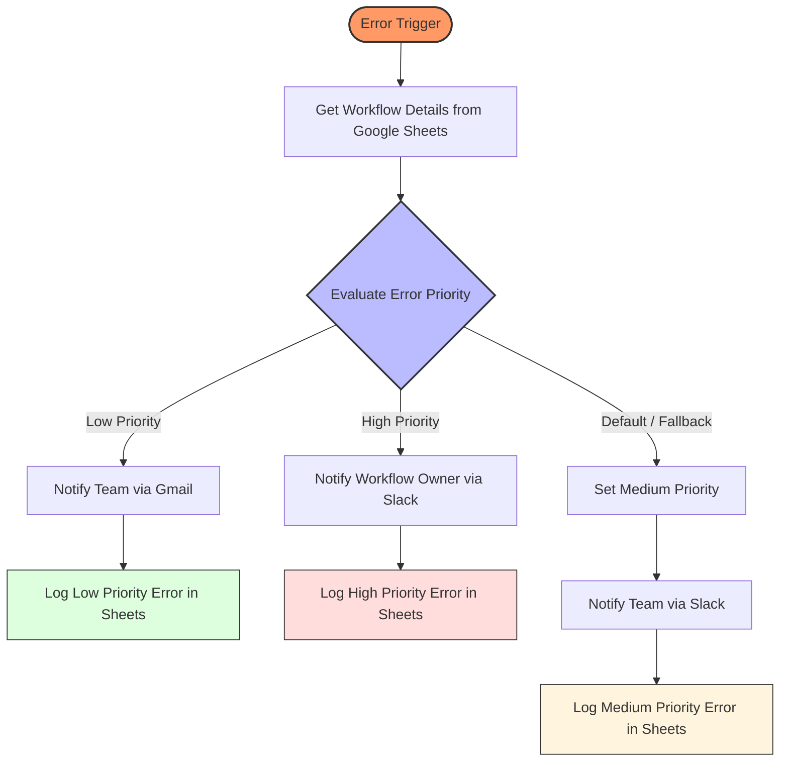

# 🛠️ Error Handling Workflow (n8n)

This centralized n8n error-handling workflow automatically captures failures across all workflows, classifies incidents by severity, routes alerts to the appropriate owners, and maintains an auditable support log for faster incident resolution.

---
## 🌟 Features 
* **Automated Error Detection**: Instantly captures failures across all workflows using a global Error Trigger.
* **Dynamic Priority Routing**: Automatically sorts errors into "High" ,"Low" or "Medium" priority based on HTTP codes and error messages.
* **Smart Lookups**: Retrieves workflow owner details and Slack IDs from a centralized Google Sheet for personalized alerts.
* **Interactive Slack Alerts**: Sends rich notifications with "Debug Here" buttons that link directly to the failed execution.
* **Automated Audit Logging**: Maintains a historical record of all errors, including node names and error messages, in Google Sheets.
* **Fail-Safe Notifications**: Notifies the broader team via Gmail if an error doesn't meet high-priority Slack criteria.
---
## 🚀 Workflow Logic Overview

1.  **Error Detection**: The workflow starts with an **Error Trigger**, which captures details from any failing workflow in n8n instance.
2.  **Data Retrieval**: It fetches the "Workflow Owner" and "Slack ID" from a central **Google Sheet** (Workflow Details) based on the name of the failing workflow.
3.  **Priority Evaluation**: A **Switch Node** checks the error message and HTTP code:
    * **Low Priority**: Triggered by "Missing Information" or "Invalid Data" messages.
    * **High Priority**: Triggered by specific HTTP error codes (e.g., `400`, `404`).
    *  **Medium Priority**: Default fallback branch for all uncategorized errors.
4.  **Notification**: 
    * **High Priority**: Sends a detailed, interactive **Slack message** directly to the workflow owner with a "Debug" button.
    * **Low Priority**: Sends a summary **Gmail notification** to the general team.
    *  **Medium Priority**: Sends a Slack alert to the team.
5.  **Logging**: Every error is logged back into a **Google Sheet** (Log Error tab) with the error message, node name, execution URL, and priority level.

---

## 📈 Business Benefits

- Enables owner-based alert routing
- Maintains centralized audit trail
- Improves root cause analysis
- Supports production operations governance

  ---
  
## **Tech Stack**
* **n8n**: Low-code workflow automation and error-trigger logic.
* **Google Sheets**: Workflow metadata lookup and error logging.
* **Slack**: Interactive Block Kit alerts for High-Priority errors.
* **Gmail**: Email notifications for Low-Priority team alerts.

---

## 📋 Setup

### 1. Google Sheets Configuration

### 2. Credentials
You will need to connect the following accounts in n8n:
* **Google Sheets OAuth2**: For reading and writing logs.
* **Gmail OAuth2**: For sending team alerts.
* **Slack OAuth2**: For sending owner-specific notifications.

### 3. Error Handler Assignment
To use this workflow, go to the **Settings** of any other workflow and set this "Error Handling Workflow" as the designated **Error Workflow**.

---
## 🧪 Debugging Note
The workflow includes pinned data for an "AI Sales Email Follow up" failure (NodeApiError 400). You can use this pinned data to test the Slack and Gmail
formatting without needing to trigger a real error.

## 📸 Visualizing the Output

### 1. Workflow Execution

### 2. Error workflow

### 3. Gmail Message

### 4.Slack Notification

