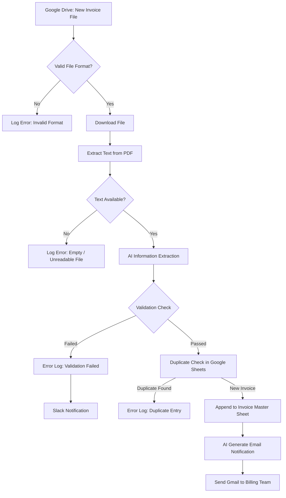

# 🧾 AI Invoice Extraction & Billing Automation

This solution eliminates manual invoice data entry by automating the full invoice intake lifecycle—from file detection and intelligent data extraction to validation, duplicate checks, centralized logging, and billing team notifications.

The workflow improves processing speed, reduces human error, and ensures audit-ready invoice tracking.

---

## ✨ Key Features

* **Automated File Monitoring**: Watches a specific **Google Drive** folder for any new file uploads.
* **Intelligent OCR & Extraction**: Uses an AI-powered **Information Extractor** to pull specific fields like Company Name, Invoice Number, Date, Total Amount, and Payment Method.

* **Database Synchronization**: Automatically appends extracted data as new rows in a **Google Sheets** database.
* **Instant Billing Notifications**: Generates a professional notification email via **Open AI** and sends it to the billing department via **Gmail**.

---

## 🏗️ System Architecture

---

## 📋 Workflow Breakdown

### 1. Detection and Extraction
The workflow triggers every minute to check a designated Google Drive folder. When a new invoice is found, it downloads the file and converts the PDF content into readable text.

### 2. AI-Powered Data Mapping
The **Information Extractor** node is configured to find nine specific attributes, including Customer Name, Address, and Line Items. This ensures accuracy even if different vendors use different invoice layouts.

### 3. Record Keeping
Once extracted, the data is formatted and appended to a **Google Sheets** document titled "sample". This creates a reliable, automated paper trail for all incoming expenses.

### 4. Reliability & Data Integrity  

* **File Format Validation**: Only processes PDFs to prevent system crashes and ensure data consistency.
* **Data Completeness**: Automatically verifies that critical fields—specifically the **Invoice No** and **Total Amount**—exist before proceeding to the logging stage.
* **Deduplication**: Queries the existing Google Sheet database to confirm the invoice has not been processed previously, ensuring the same invoice is never paid or logged twice.

### 5. Internal Notification
Finally, the AI drafts a JSON-formatted email subject and body. This is sent to the internal billing contact, providing a summary and a link to the master database for review.

---
## ✅ Data Validation & Exception Handling

To ensure data integrity and process reliability, the workflow includes multiple validation layers:

### File Validation
- Accepts only PDF files
- Invalid formats are routed to Error Log

### Extraction Validation
The workflow validates:
- Invoice Number exists
- Invoice Date exists
- Total Amount > 0

If validation fails:
- Record is logged into Error Log sheet
- Slack notification is sent to operations team

### Duplicate Check
Before inserting into the master invoice sheet, the workflow checks whether the Invoice Number already exists.

If duplicate found:
- Record is redirected to Error Log
- Duplicate reason is captured
- New row insertion is skipped

  ---
  
## 🔮 Future Enhancements

- OCR support for scanned and image-based invoices
- Auto-approval workflow for low-risk invoices
- Extend the workflow to process multiple invoice input formats

  ---

## 📈 Business Impact

-Reduces manual data entry time by 90%.
-Minimizes human error in financial logging
-Ensures 100% of invoices are captured within 60 seconds of arrival.

---

## 🛠️ Tech Stack

* **Automation Engine**: [n8n.io]
* **AI Models**: OpenAI GPT-4o-mini
* **Storage**: Google Drive & Google Sheets
* **Communication**: Gmail

  ---

## ⚙️ Setup Instructions

1. **Import Workflow**: Download the `Invoice.json` file and import it into your n8n canvas.

2. **Credential Configuration**:
   The specific nodes in this workflow require you to link your own credentials. You must set up the following in the n8n **Credentials** menu:
   * **OpenAI API**: Create a new 'OpenAI API' credential using your API Key to power the `Information Extractor` and `Message a model` nodes.
   * **Google Drive & Sheets**: Set up 'Google Sheets OAuth2 API' and 'Google Drive OAuth2 API' to allow the workflow to watch your folders and update your spreadsheets.
   * **Gmail**: Configure 'Gmail OAuth2 API' to enable the system to send the automated billing notifications.
   * **Slack**: Set up 'Slack OAuth2 API' to receive validation error alerts.

3. **Node ID Mapping**:
   After creating your credentials, open each node (Google Drive, OpenAI, Google Sheets, Gmail) and select your newly created credential from the dropdown menu to link them to the specific Node IDs mentioned in the JSON.

4. **Environmental Variables**: 
   If you are self-hosting n8n, ensure your `.env` file is configured with the correct `N8N_ENCRYPTION_KEY` to maintain credential security during the import/export process.
 
## 📸 Visualizing the Output

### 1. Workflow Execution

### 2. Attribute extraction using Open AI

### 3. Appending the Information to Google sheets

### 4.Using AI to send notification to billing team

---

