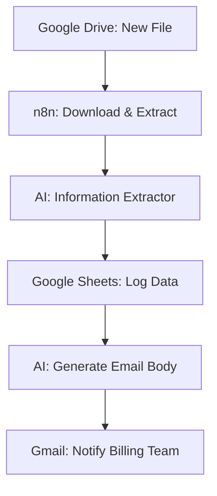

# 🧾 AI Invoice Extraction & Billing Automation

This Automation stop manually entering data from invoices. This **n8n workflow** automatically detects new invoice files, uses **Open AI** to read the contents, logs the details into a spreadsheet, and notifies your billing team—all within seconds of a file being uploaded.

---

## ✨ Key Features

* **Automated File Monitoring**: Watches a specific **Google Drive** folder for any new file uploads.
* **Intelligent OCR & Extraction**: Uses an AI-powered **Information Extractor** to pull specific fields like Company Name, Invoice Number, Date, Total Amount, and Payment Method.
* **Database Synchronization**: Automatically appends extracted data as new rows in a **Google Sheets** database.
* **Instant Billing Notifications**: Generates a professional notification email via **Open AI** and sends it to the billing department via **Gmail**.

---

## 🏗️ System Architecture

## 🛠️ Tech Stack

* **Automation Engine**: [n8n.io]
* **AI Models**: OpenAI GPT-4o-mini & GPT-4.1-mini
* **Storage**: Google Drive & Google Sheets
* **Communication**: Gmail

---

## 📋 Workflow Breakdown

### 1. Detection and Extraction
The workflow triggers every minute to check a designated Google Drive folder. When a new invoice is found, it downloads the file and converts the PDF content into readable text.

### 2. AI-Powered Data Mapping
The **Information Extractor** node is configured to find nine specific attributes, including Customer Name, Address, and Line Items. This ensures accuracy even if different vendors use different invoice layouts.

### 3. Record Keeping
Once extracted, the data is formatted and appended to a **Google Sheets** document titled "sample". This creates a reliable, automated paper trail for all incoming expenses.

### 4. Internal Notification
Finally, the AI drafts a JSON-formatted email subject and body. This is sent to the internal billing contact, providing a summary and a link to the master database for review.

---

## ⚙️ Setup Instructions

* **Import**: Download the `Invoice.json` file and import it into the n8n canvas.

* **API Credentials**:
    * **OpenAI**: Required for the Information Extractor and Message Model.
    * **Google Drive & Sheets**: Connect the Google account to watch folders and edit spreadsheets.
    * **Gmail**: Set up OAuth2 to send internal notifications.

* **Configuration**:
    * Update the **Google Drive Trigger** with the specific Folder ID.
    * Update the **Google Sheets** node with the URL of the tracking spreadsheet.
