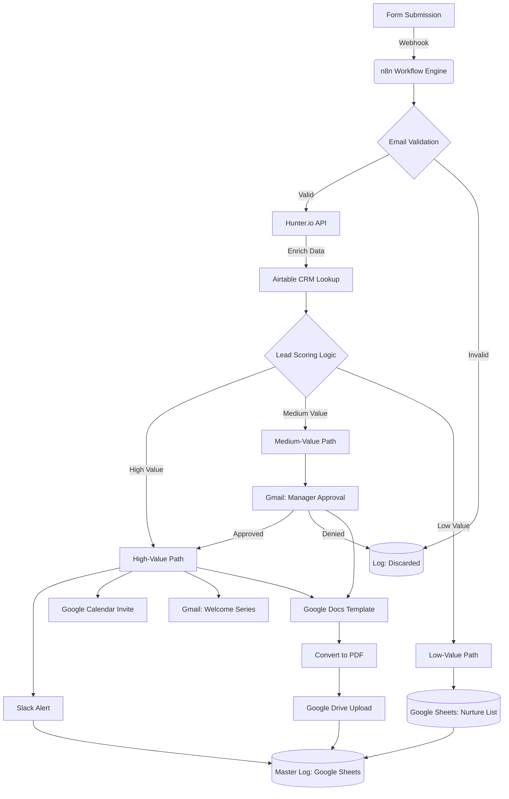

# Lead Qualification & Enrichment Automation

An end-to-end **n8n workflow** designed to automate the lead intake, validation, enrichment, and routing process. This system filters out low-quality leads, calculates lead scores, and triggers personalized engagement via Slack, Gmail, and Google Calendar.

---

## 🚀 Overview

This workflow acts as an automated **Sales Development Representative (SDR)**. It handles everything from initial form submission to booking meetings for high-value leads, ensuring your sales team only focuses on qualified opportunities.

---

## ✨ Features

* **Multi-Stage Validation**: Combines internal logic with **Hunter.io** to verify email deliverability and filter out temporary or fake domains.
* **Deep Lead Enrichment**: Uses the Hunter API to retrieve company details, social profiles, and industry group data.
* **CRM Integration**: Syncs with **Airtable** to check existing customer status (New, General, or VIP) and revenue history.
* **Dynamic Lead Scoring**: A custom logic engine categorizes leads into High, Medium, and Low value based on geography, industry (e.g., Software), and email scores.
* **Automated Document Generation**: Creates a personalized "Lead Brief" in Google Docs, converts it to PDF, and stores it in Google Drive.
* **Sales Orchestration**:
    * **High Value**: Immediate Slack alert to Account Executives and automated Google Calendar scheduling.
    * **Medium Value**: Triggers an approval workflow via Gmail for manual manager review.
    * **Low Value**: Automatically added to a "Nurture List" in Google Sheets.

---

## 🛠️ Tech Stack

* **Automation**: [n8n.io](https://n8n.io/)
* **Intelligence**: Hunter.io (Email Verifier & Information Discovery)
* **CRM/Database**: Airtable, Google Sheets
* **Communication**: Slack, Gmail
* **Productivity**: Google Docs, Google Drive, Google Calendar

---

## 📋 Workflow Logic

1.  **Trigger**: Form submission (Name, Email, Company, Interest Area).
2.  **Validation**: Basic regex and domain checks, followed by Hunter.io's 3rd-party verification.
3.  **Enrichment**: Data retrieval via Hunter Combined API and Airtable lookup.
4.  **Classification**:
    * **Switch Logic**: Segments leads by customer type and revenue.
    * **Scoring**: Incremental scoring based on country (US, UK, IN, DE) and industry group (Software/Marketing).
5.  **Action Paths**:
    * **High-Value**: Slack Notification ➡️ Google Calendar Event ➡️ Welcome Email ➡️ 4-day Wait ➡️ Follow-up Email.
    * **Medium-Value**: Manager Approval Request ➡️ If approved, routes to High-Value path.
    * **Low-Value/Discarded**: Logged in Google Sheets for future marketing nurture.
  

    
## ⚙️ Setup

1.  **Import Workflow**: Download the `Lead_Automation_Workflow.json` and import it into your n8n instance.
2.  **Credentials**: Set up API credentials for:
    * Hunter.io
    * Google Cloud (Gmail, Drive, Docs, Calendar, Sheets)
    * Slack (OAuth)
    * Airtable

3.	**Environment Variables**: Ensure the Folder IDs and Spreadsheet IDs in the node parameters match your local setup.

## 📸 Visualizing the Output

### 1. Workflow Execution

### 2.Lead Submission Form

### 3.Enrich Lead Information

### 4. Check for new or existing customer in CRM based on the email address.
       When the email adress is found it returns the data with the details available on CRM otherwise no output is returned and treated as **NEW CUSTOMER**

### 5.The Lead is classified as NEW,GENERAL OR VIP

### 6.Lead score is calculated based on email score,Industry and REgion

### 7.Lead Qualified Brief have been created ion Google Drive and the value has been updated dynamically

### 8. Sample values have been updated

### 9.Content Coordinator have been notified

### 10.At the same time Account executive have been notified and calendar event have been created and welcome email have been sent to the lead

