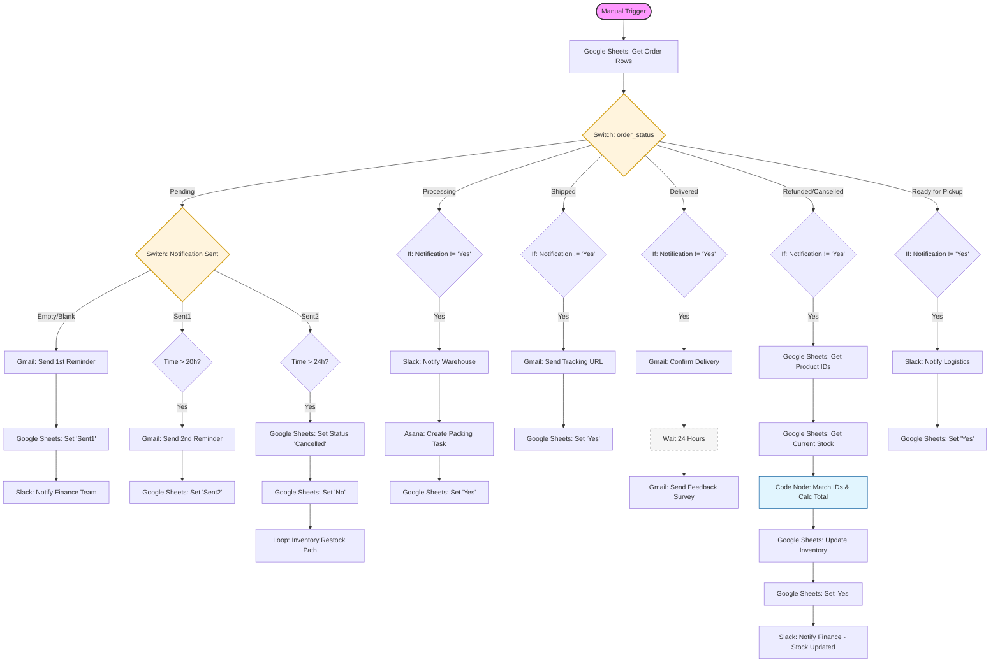

# 🚀 Order Status Automation System (n8n Workflow)

An end-to-end automation workflow for managing e-commerce orders, payments, logistics, and customer communication using n8n.

---

## 🚀 Overview

This workflow acts as a centralized automation engine for e-commerce operations. It retrieves order data from Google Sheets and processes it through structured logic to handle payment tracking, order fulfillment, inventory updates, and customer communication.

The system ensures that each order is processed based on its real-time status while minimizing manual intervention and preventing duplicate notifications.

---

## ✨ Key Features

- **Automated Payment Reminders**  
  Sends reminder emails for pending payments. If payment is not received within 24 hours, the order is automatically cancelled and stakeholders are notified.

- **Warehouse & Logistics Integration**  
  - Sends Slack notifications to the warehouse team for new processing orders  
  - Automatically creates packing tasks in Asana  
  - Notifies the logistics team when orders are ready for pickup  

- **Shipping & Delivery Automation**  
  - Sends tracking details to customers once the order is shipped  
  - Confirms delivery via email  

- **Inventory Management**  
  Automatically updates stock levels in Google Sheets when orders are cancelled or refunded  

- **Customer Experience Enhancement**  
  Sends a feedback survey 24 hours after successful delivery  
---

## 🛠️ Tech Stack

- **n8n** – Workflow automation  
- **Google Sheets** – Data storage (Orders, Payments, Inventory)  
- **Gmail** – Customer communication  
- **Slack** – Internal notifications  
- **Asana** – Task management  

---

## 📋 Workflow Logic

### 1. Data Retrieval

The workflow is triggered manually (or via a scheduled Cron job) and retrieves order data from the **Order Details** sheet in Google Sheets.

### 2. Status-Based Routing (Switch Engine)

Each order is routed into a specific processing path based on its current status:

- **Pending**  
  Triggers a two-stage reminder system. If payment is not completed within 24 hours, the order is automatically cancelled.

- **Processing**  
  Sends a Slack notification to the warehouse team and creates a packing task in Asana.

- **Shipped**  
  Sends tracking details (DHL) to the customer via email.

- **Delivered**  
  Sends a delivery confirmation email followed by a feedback request after 24 hours.

- **Refunded / Cancelled**  
  Updates inventory and notifies the finance team.

- **Ready for Pickup**  
  Notifies the logistics team to arrange shipment pickup.

### 3. Safety Checks

To prevent duplicate notifications, the workflow includes conditional checks to verify whether a notification has already been sent. This ensures that customers and internal teams do not receive repeated messages for the same event.

---

## 💼 Business Impact

This workflow helps e-commerce teams:

- Reduce manual effort in order tracking and communication  
- Improve operational efficiency  
- Ensure timely payment follow-ups  
- Maintain accurate inventory records  
- Enhance customer experience through timely updates

  ---

## 🚀 Future Improvements

- Replace Google Sheets with a scalable database (e.g., PostgreSQL)
- Introduce error handling and retry mechanisms
- Convert manual trigger to event-driven automation (webhooks)
- Improve monitoring and logging

  ---

## 📸 Visualizing the Output

### 1. Workflow Execution

### 2.Routing Conditions

### 3.Inventory Data

### 4.Order details(Google Sheets) with Pending Status

### 5.First Reminder Sent to Customer (Status: NONE → Sent1)

### 6.Alert the Finance Team

### 7.If notification is Sent1 :Calculate time difference 

### 8.Second Reminder Sent (After 20 Hours)

### 9.Wait 4 hours and get the Payment and Order details from database

### 10.Auto-Cancellation After 24 Hours

### 11.Order details and Inventory Details

### 12.Order Details after Auto Cancelling

### 13.Inventory data :Stocks has been updated 

### 14.Inventory updation has been notified in the Order details

## 🔧 Setup Instructions

### 1. Import Workflow
Download the `Order_Status_Automation_Final.json` file from this repository and import it into your n8n instance.

### 2. Configure Credentials
You will need to connect the following accounts within n8n:
* **Google Sheets:** Connect your Google Service account or OAuth2.
* **Gmail:** Set up OAuth2 for the customer service email address.
* **Slack:** Create a Slack App in your workspace and provide the **Bot Token**.
* **Asana:** Connect via Personal Access Token (PAT) or OAuth2.

### 3. Customize IDs
* **Sheet IDs:** Ensure the `documentId` in all Google Sheets nodes is updated to match your specific Spreadsheet ID.
* **Channel IDs:** Update the Slack channel IDs to match your specific workspace channels for Finance, Warehouse, and Logistics.

