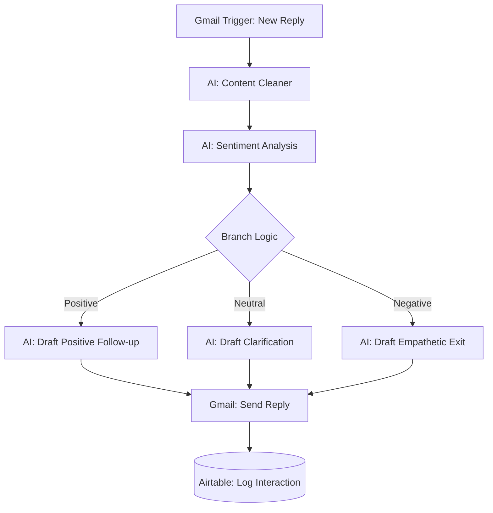

# 📧 AI Sales Email Follow-up

An intelligent **n8n workflow** designed to manage the critical "last mile" of sales communication. This system listens for incoming replies, cleans the text using AI, determines sentiment, and drafts personalized, context-aware responses.

---

## ✨ Key Features

* **Automated Response Cleaning**: Uses **Open AI** to strip away email threads, signatures, and disclaimers, isolating the actual message from the prospect.
* **Sentiment Intelligence**: Classifies incoming replies into **Positive**, **Neutral**, or **Negative** categories to determine the next best action.
* **Contextual Auto-Replies**: 
    * **Positive**: Drafts an enthusiastic, professional follow-up to move the deal forward.
    * **Neutral**: Provides clarification and gentle encouragement to re-engage.
    * **Negative**: Responds with empathy and professionalism, offering alternatives without being pushy.
* **Airtable Integration**: Automatically logs the full conversation history, including the prospect's response and the AI's follow-up, for easy tracking.

---

## 🏗️ System Architecture

## 🛠️ Tech Stack

* **Automation Engine**: [n8n.io](https://n8n.io/)
* **AI Models**: OpenAI GPT-4.1-mini 
* **Communication**: Gmail (OAuth2)
* **CRM/Database**: Airtable
* **Logic**: n8n Switch & Wait nodes for natural timing

---

## 📋 Workflow Breakdown

### 1. Ingestion & Pre-processing
The workflow triggers when a new email is received in Gmail. A **Wait node** introduces a small delay to mimic natural human behavior, followed by an **AI node** that removes "noise" like threads and metadata from the email body.

### 2. Sentiment Classification
The cleaned text is analyzed by a specialized sentiment agent. It detects if the client is interested (**Positive**), undecided (**Neutral**), or rejecting the offer (**Negative**).

### 3. Response Generation
Based on the sentiment, a dedicated AI node drafts a response in clean HTML. **Positive** replies focus on next steps, while **Negative** replies focus on maintaining a bridge for the future.

### 4. Sending & Logging
The response is sent as a direct reply to the original Gmail thread. Finally, the prospect's name, email, original response, and the AI's follow-up are saved to **Airtable** for sales team visibility.

---

## ⚙️ Setup Instructions

* **Import**: Import the `AI_Sales_Email_Follow_up.json` file into n8n.

* **API Credentials**:
    * **OpenAI**: Required for cleaning and sentiment nodes.
    * **Gmail**: Set up OAuth2 to allow n8n to read and send replies.
    * **Airtable**: Connect your Personal Access Token and select your target Base/Table.

* **Airtable Fields**: Ensure your table includes columns for `FullName`, `Email`, `Client Response`, `Follow Up Email`, and `Status`.

## 📸 Visualizing the Output

### 1. Workflow Execution

### 2.Email sent from sales team to Lead 

### 3.Cleaner Response Email (Using AI)

### 4.Using AI for Sentiment Analysis

### 5.Generating automatic Follow up email using AI and sending using Gmail

### 6.Logging the entry into Airtable

