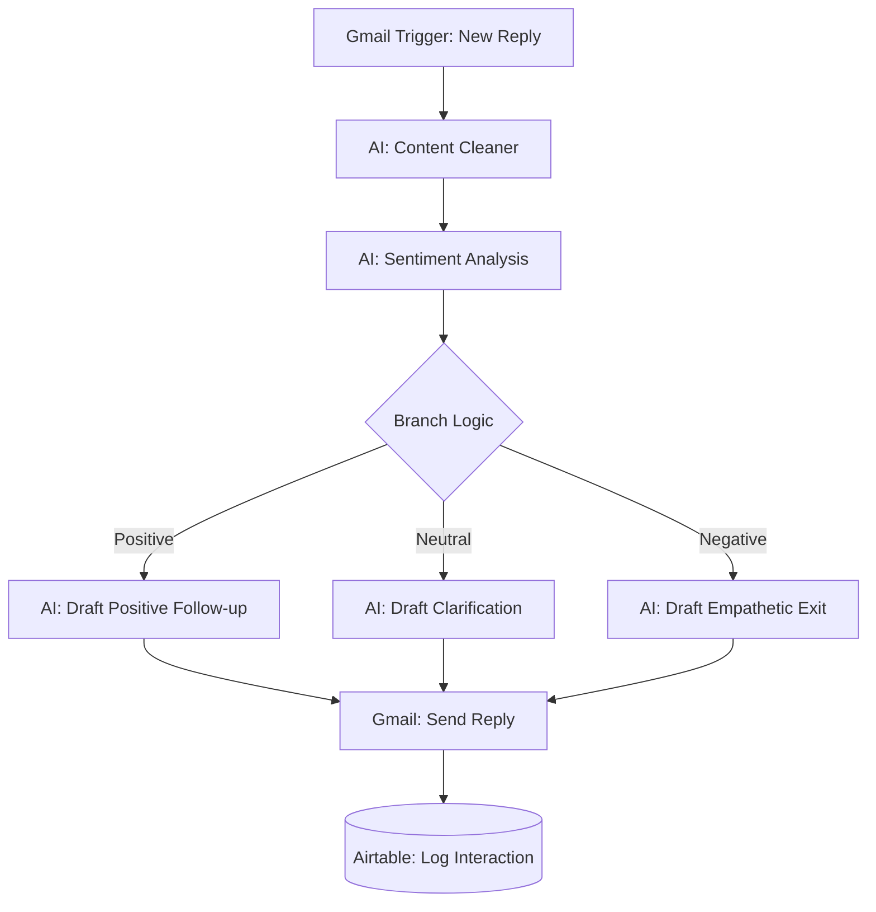

# 📧 AI-Powered Sales Email Follow-up Automation (n8n)

An intelligent workflow that automates sales email responses using AI-driven sentiment analysis and context-aware reply generation.

---
## ✨ Key Features

- **Automated Email Cleaning**  
  Uses OpenAI to remove email threads, signatures, and disclaimers, extracting only the relevant message content.

- **Sentiment Intelligence**  
  Classifies replies into **Positive**, **Neutral**, or **Negative** categories to determine the appropriate response strategy.

- **Context-Aware Auto-Replies**  
  - **Positive**: Generates a professional follow-up to move the conversation forward  
  - **Neutral**: Provides clarification and encourages engagement  
  - **Negative**: Responds with empathy while keeping future opportunities open  

- **Automated CRM Logging**  
  Stores the full interaction (client response + AI reply) in Airtable for tracking and visibility

  ---
  ## 📋 Workflow Breakdown

### 1. Ingestion & Pre-processing
The workflow triggers when a new email is received in Gmail. A **Wait node** introduce a natural delay before responding, followed by an **AI node** that removes "noise" like threads and metadata from the email body.

### 2. Sentiment Classification
AI model performs sentiment classification. It detects if the client is interested (**Positive**), undecided (**Neutral**), or rejecting the offer (**Negative**).

### 3. Response Generation
Based on the sentiment, a dedicated AI node drafts a response in clean HTML. **Positive** replies focus on next steps, while **Negative** replies focus on maintaining a bridge for the future.

### 4. Sending & Logging
The response is sent as a direct reply to the original Gmail thread. Finally, the prospect's name, email, original response, and the AI's follow-up are saved to **Airtable** for sales team visibility.

---

## 🏗️ System Architecture

---
## 🛠️ Tech Stack

- **n8n** – Workflow automation  
- **OpenAI (GPT-4.1-mini)** – Text cleaning, sentiment analysis, and response generation  
- **Gmail** – Email communication (OAuth2)  
- **Airtable** – CRM and interaction logging  

---
## 💼 Business Impact

This system helps sales teams:

- Respond to leads faster and more consistently  
- Improve engagement with personalized communication  
- Reduce manual workload in email handling  
- Maintain structured records of all interactions  

---

## 🚀 Future Improvements
  
- Introduce lead scoring based on sentiment trends  
- Integrate with CRM platforms (e.g., HubSpot, Salesforce)  
- Implement human-in-the-loop approval for high-value leads  

## ⚙️ Setup Instructions

### 1. Import Workflow
Import the `AI_Sales_Email_Follow_up.json` file into n8n.

### 2. Configure Credentials
- **OpenAI** – Required for cleaning, sentiment analysis, and response generation  
- **Gmail** – OAuth2 setup for reading and sending emails  
- **Airtable** – Connect using Personal Access Token  

### 3. Airtable Configuration
Ensure your table includes the following fields:
- `FullName`  
- `Email`  
- `Client Response`  
- `Follow Up Email`  
- `Status`

  ---
## 📸 Visualizing the Output

### 1. Workflow Execution

### 2. Email sent from sales team to Lead 

### 3. Cleaner Response Email (Using AI)

### 4. Using AI for Sentiment Analysis

### 5. Generating automatic Follow up email using AI and sending using Gmail

### 6. Logging the entry into Airtable

