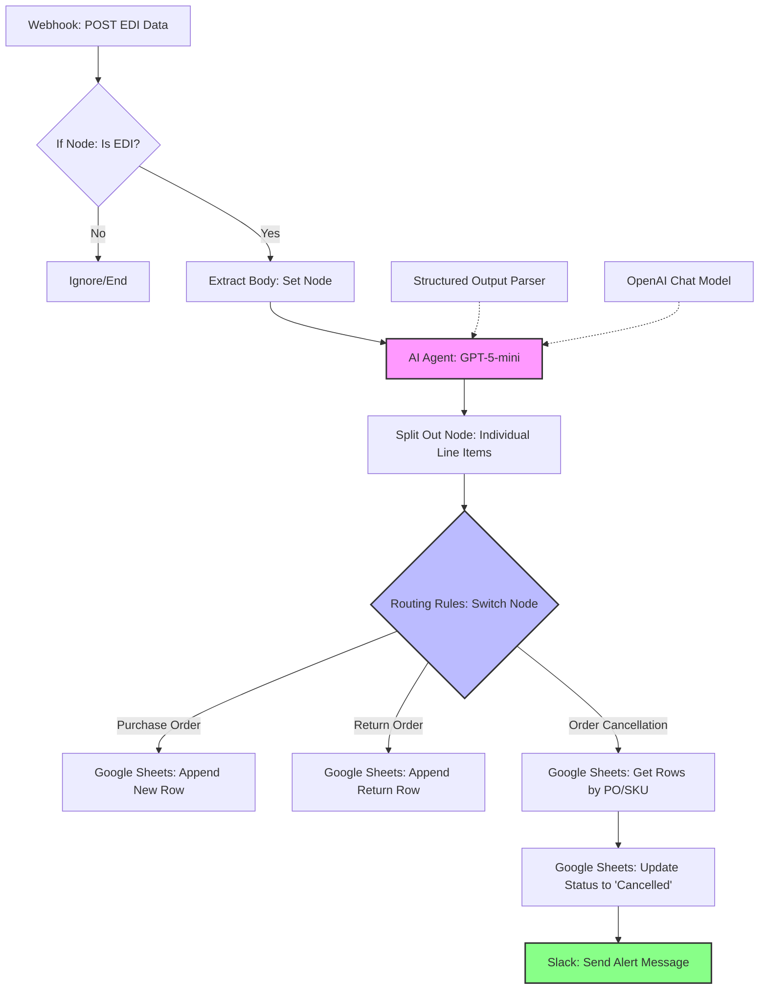

# 🌐 Supply Chain EDI Automation Workflow

An automated supply chain solution built with **n8n** that intercepts EDI (Electronic Data Interchange) messages via webhooks, parses them using **AI**, and synchronizes the data with **Google Sheets** and **Slack**.

---

## 🚀 Overview
This workflow is designed to handle three critical supply chain transactions automatically:

* **Purchase Orders (850/ORDERS):** Logs new orders into the CRM.
* **Return Orders (180/RETANN):** Records return requests and reasons.
* **Order Cancellations (860/ORDCHG):** Updates existing CRM entries to "Cancelled" status and alerts the team via Slack.

* ## 🧪 Simulation & Testing

In a real enterprise environment, EDI messages are typically generated and sent by ERP systems such as **SAP**, **Odoo**, or **weclapp** through integration platforms or secure protocols (e.g., **AS2** or **SFTP**).

Since a full ERP environment was not available for this project, **Postman** was used to simulate an ERP system sending EDI messages to the **n8n webhook endpoint**.

* **The Process**: Postman sends `HTTP POST` requests containing EDI-style messages, which trigger the automation workflow.
* **The Result**: The workflow then parses the message, converts it into structured data using AI-based extraction, and stores the processed information in the CRM system.

* ## 🧬 Workflow Logic

### 1. Ingestion & Filtering
* **Webhook Node**: Receives incoming `POST` requests containing raw email or EDI data.
* **If Node**: Performs a security and document type check to ensure the payload is a valid EDI string before proceeding.

### 2. AI Parsing (The Brain)
The **AI Agent** uses a sophisticated system prompt to translate "machine-readable" EDI into a structured JSON format.
* **Mapping**: Automatically identifies key segments such as `NAD+BY` (Buyer), `LIN` (Line Items), and `QTY` (Quantity).
* **Calculations**: Manually calculates the `grand_total` by multiplying `quantity * unit_price` for every line item to ensure financial accuracy.
* **Intelligence**: Detects the transaction type (New Order, Return, or Cancellation) based on header codes, such as `BGM+105` for cancellations.

### 3. Data Transformation
* **Split Out**: Converts a single EDI message containing multiple line items into individual records. This ensures that a Purchase Order with two different SKUs creates two separate rows in Google Sheets.

### 4. Routing & Actions
The **Switch Node** routes the processed data based on the identified `document_type`:
* **Purchase Orders**: Appended directly to the "Purchase Order" Google Sheet.
* **Return Orders**: Appended to the "Return Order" sheet along with specific return reason codes.
* **Cancellations**:
    * Triggers a **Lookup** in the Google Sheet to find the original entry.
    * Updates the specific row status to **"Cancelled"**.
    * Sends an instant notification to **Slack** including the Order Number and SKU.

## 🛠️ Tech Stack

* **Automation Platform**: [n8n](https://n8n.io/)
* **AI Engine**: OpenAI **GPT-5-mini** 
* **LLM Framework**:  (Agent, Chat Model, and Structured Output Parser)
* **Database**: **Google Sheets** (used as a lightweight CRM)
* **Communication**: **Slack** (Real-time notifications)
* **Protocol Support**: **Webhook** (POST method)

## 📸 Visualizing the Output

### 1. Workflow Execution

### 2. CRM Data (Google Sheets)

### 3. Slack Notifications (Cancellations)

